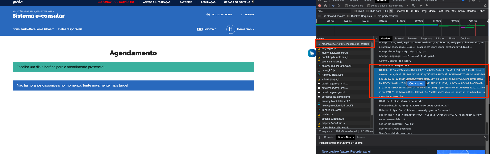

# Checagem automática de horários do Consulado Brasileiro em Portugal

Esse script em Python vefifica automaticamente por horários para serviços no consulado brasileiro. 
Para tal é necessário saber o id do processo e copiar o cookie após logar no sistema do consulado.

Obs.: esse script foi testado apenas para o sistema de agendamento do consulado brasileiro em Lisboa. 
Pode ser que funcione para o do Faro ou o do Porto. Se sim, me informe por favor. Se não, abra um PR :D

## Configuração

Execute `pip install -r requirements.txt` para instalar as depedências.

#### Quickstart: 
 - salve o cookie da sua sessão em um arquivo `cookie.txt`. Esse arquivo deve estar na mesma pasta do script;
 - substitua o id do processo no script [nessa linha](https://github.com/HemersonTacon/check_consulate/blob/main/check_consulate.py#L111);
 - execute `python check_consulate.py 1` num terminal para checar de 1 em 1 minuto.
 - ou passe o id manualmente com a opção `-id`, exemplo: `python check_consulate.py 1 -id L3TR4SeNUM3R05do1D`;
 
Detalhes de como obter o id do processo e o cookie abaixo.

### ID do processo

Após [logar no sistema do consulado](https://ec-lisboa.itamaraty.gov.br/login), selecione o processo para qual deseja monitorar as vagas.
O id do processo é compostos por números e letras estará no fim da URL após "id=".

### Cookie

Após [logar no sistema do consulado](https://ec-lisboa.itamaraty.gov.br/login), selecione o processo para qual deseja monitorar as vagas.
 - ative a inspeção do navegador (`Ctrl + Shift + I` ou `Opt + Cmd + I`);
 - clique na aba `Rede`/`Network`. 
 - atualize a página (`Ctrl + F5` ou `Cmd + F5`);
 - selecione o primeiro elemento da lista. Ele deverá começar com "process?id=<seu id do process>";
 - no painel que se abrirá, role até a seção "Request Headers" e procure por "Cookie:";
 - clique com o botão direito e selecione a única opção que aparece para copiar o valor do cookie;
 - crie um arquivo chamado `cookie.txt` e cole o conteúdo do cookie nesse arquivo. 
 Esse arquivo tem de estar na mesma pasta do script.
 
 
 
## Mensagens

Uma lista de mensagens e significado. Essa lista pode ficar desatualizada em caso de alterações no site do consulado.

 - `No slots available.`: não há horários disponíveis para o serviço (mensagem mais comum que você verá, infelizmente);
 - `Looks like there are spots available!`: dia de sorte, há vagas disponíveis para o seu serviço. 
 Um sinal sonoro (beep) será emitido intermitentemente durante aproximadamente 2 minutos e meio.
 - `Unexpected content on response. Update cookie and try again.`: muito provavelmente seu cookie expirou. 
 Alguns beeps também serão emitidos para chamar sua atenção a isso.
 Simplesmente logue novamente no sistema usando o navegador e atualize o cookie da mesma forma que fez inicialmente.
 Em minha experiência de deixar o script rodando durante o horário de trabalho, isso ocorre 1 vez por dia próximo do fim do expediente.
 - outras mensagens: ou está sem internet ou o serviço do consulado está com problemas (ou alguma outra coisa). 
 Tente acessar o site do consulado normalmente pelo navegador para tentar investigar o que está acontecendo.

